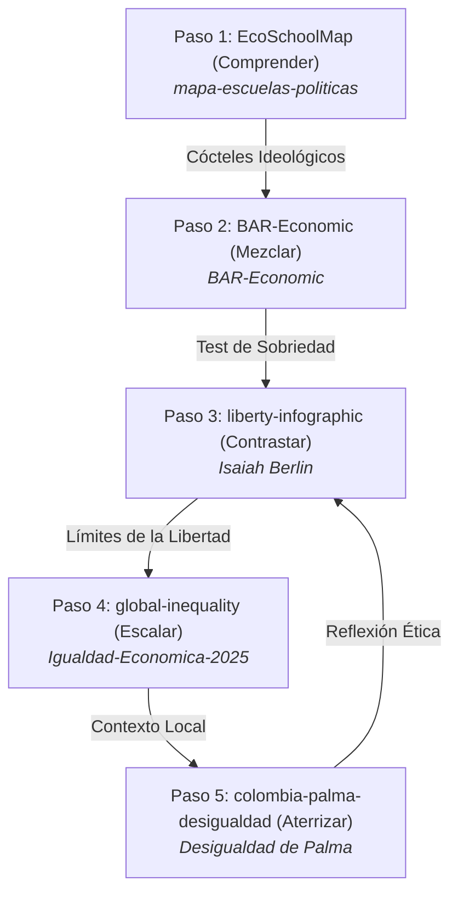

# 🗽 Anatomía de la Libertad · Paso 3 / Anatomy of Liberty · Step 3

### *Infografía interactiva y ensayo editorial sobre los marcos teóricos de la libertad política: Berlin, Sen, Hayek/Friedman.*
### *An interactive infographic and editorial essay on the theoretical frameworks of political liberty: Berlin, Sen, Hayek/Friedman.*

---

[](https://willkwolf.github.io/isaiah-berlin-liberty-infographic/)
[](https://github.com/willkwolf/isaiah-berlin-liberty-infographic)
[](https://creativecommons.org/licenses/by-nc-sa/4.0/)
[](https://jestjs.io/)

---

## 🌐 Demo en Vivo / Live Demo
**👉 [Ver en vivo en GitHub Pages](https://willkwolf.github.io/isaiah-berlin-liberty-infographic/)**

---

## 🧭 La Ruta del Pensamiento Crítico (El Ecosistema)
Este proyecto forma parte de **"La Ruta del Pensamiento Crítico"**, una red interactiva de 5 webs estáticas de `@willkwolf` que conectan teoría económica, dilemas políticos, brechas materiales y contextos locales.



> [!NOTE]
> **Estás en el Paso 3: Contrastar**. En los pasos anteriores comprendiste y mezclaste escuelas. Aquí confrontas las tensiones filosóficas sobre qué significa ser libre. Al final, las limitaciones materiales de la libertad te invitarán a explorar la escala de la brecha económica en el **Paso 4: Desigualdad Global: ¿A qué altura vives?**

---

## 🔍 Contexto Temático / Philosophical Context

### Español
La motivación central de esta infografía interactiva es desmitificar el concepto de **libertad**, especialmente cuando es reducido, apropiado o instrumentalizado por sectores políticos como si tuviera un único significado obvio. **Isaiah Berlin** es útil precisamente porque interrumpe esa simplificación. Su trabajo ayuda a mostrar que la libertad no es un eslogan, no es una marca política y no es un único resultado de política pública. Es un campo de interpretación en disputa, ligado al poder, la igualdad, la capacidad, la coacción, las instituciones y el conflicto social.

El proyecto también dialoga con la pregunta que el **dataísmo** plantea de fondo: si los datos son la nueva forma de autoridad epistémica, ¿qué ocurre cuando los mismos datos producen diagnósticos radicalmente distintos según el marco teórico que los lee? Esta infografía es una respuesta práctica. Los índices reales de Colombia (IDH, IPM, Libertad Económica, Freedom House) no cambian. Lo que cambia es la interpretación — y esa diferencia no es un error de lectura, sino el núcleo del conflicto político.

---

### English
The main motivation behind this infographic is to demystify the concept of **liberty**, especially when it is reduced, appropriated, or weaponized by political sectors as if it had only one obvious meaning. **Isaiah Berlin** is useful precisely because he interrupts that simplification. His work helps show that liberty is not a slogan, not a branding device, and not a single policy outcome. It is a contested field of interpretation tied to power, equality, capability, coercion, institutions, and social conflict.

The project also speaks to a core question raised by **dataism**: if data is the new form of epistemic authority, what happens when the same data produces radically different diagnoses depending on the theoretical framework reading it? This infographic is a practical answer to that question. Colombia's empirical indices (HDI, MPI, Economic Freedom, Freedom House) do not change. What changes is the interpretation — and that difference is not a reading error, but the heart of the political problem.

---

## 🤓 Para el Lector más Nerd / Ficha Técnica (Deep Philosophical Insights)

### 1. Sistema de Lentes Dinámicos (Real-time Lenses)
El usuario puede cambiar en tiempo real entre cuatro marcos analíticos que reinterpretan la copia y los diagramas de todo el sitio:
* **Libertad Negativa (Isaiah Berlin):** Entendida como no-interferencia y ausencia de obstáculos externos colocados por otros seres humanos.
* **Libertad Positiva (Isaiah Berlin):** Entendida como autodeterminación, autonomía, control sobre el propio destino y auto-maestría.
* **Enfoque de Capacidades (Amartya Sen / Martha Nussbaum):** Libertad sustantiva; oportunidades reales de ser y hacer lo que uno valora (salud, educación, agencia).
* **Lectura Económico-Libertaria (Hayek / Friedman):** Libertad de mercado, propiedad privada, y limitación estricta de la planificación colectiva.

### 2. Diagramas Interactivos de Tensión Epistémica
* **El Selector de Lentes:** Modifica en tiempo real los esquemas de color (`var(--clr-accent)`) sincronizándose cromáticamente con el marco elegido.
* **Sliders de Coacción:** Visualiza de dónde proviene el obstáculo real de la acción: el Estado (coacción formal), el Mercado (barreras de capital) o la Sociedad (presiones colectivas).
* **El Waffle de Capacidades:** Modela cómo la escasez material y nutricional destruye la libertad de agencia de una persona aun cuando no existan leyes que le impidan actuar.

---

## 🛠️ Stack Tecnológico / Technical Stack

* **HTML5 & CSS3 Premium:** Con diseño editorial responsivo y variables CSS dinámicas para transiciones suaves de color según el lente activo.
* **i18n Nativo (`i18n.js`):** Sistema bilingüe de traducción instantánea en tiempo real sin recarga de página que soporta español e inglés.
* **Jest Testing (v30.4.2):** Suite completa de pruebas unitarias y de integración que valida de forma automatizada:
  * El comportamiento de transiciones y sliders del DOM.
  * La accesibilidad WCAG 2.1 AA utilizando `@axe-core` y `jest-axe`.
  * La persistencia del idioma en `localStorage`.

---

## 📦 Instalación y Uso Local / Installation & Local Run

### Requisitos / Prerequisites
* **Node.js** 18+ (para correr las suites de test)

### Servidor de Desarrollo / Development
```bash
# 1. Clonar el repositorio
git clone https://github.com/willkwolf/isaiah-berlin-liberty-infographic.git
cd isaiah-berlin-liberty-infographic/files

# 2. Servir la página localmente
# Puedes usar cualquier servidor estático ligero
npx live-server
```

### Ejecutar Pruebas Automatizadas / Testing
Para correr las pruebas unitarias Jest y auditorías de accesibilidad:
```bash
# Regresa al directorio raíz de desarrollo
cd ..
npm install
npm test
```

---

## 🎙️ Podcast & Cuaderno de Fuentes / Research Trails

* **Spotify Podcast:** Para profundizar en el pensamiento de Isaiah Berlin anclado en preguntas y debates reales del contexto colombiano, escucha el podcast oficial de **William Camilo Artunduaga Viana**:  
  👉 [Escuchar en Spotify](https://open.spotify.com/show/4hRC6rIFVIozooGV6OdWOI?si=e500cb9f38684cc2)
* **NotebookLM Notebook:** Explora notas de investigación, referencias académicas cruzadas y material de apoyo bibliográfico detallado:  
  👉 [Ver el cuaderno de fuentes de NotebookLM](https://notebooklm.google.com/notebook/5ce143e6-2b6f-41e3-a96d-eb58c6fbb2a1)

---

## 📝 Cómo Citar / Citation (APA 7)

**Referencia en formato APA 7ma Edición:**
> Artunduaga Viana, W. C. (2026). *Anatomía de la Libertad: Una infografía interactiva sobre marcos teóricos de la libertad política y su tensión empírica en Colombia* [Visualización web interactiva]. GitHub. https://github.com/willkwolf/isaiah-berlin-liberty-infographic

**BibTeX para referencias académicas:**
```bibtex
@software{artunduaga2026libertad,
  author = {Artunduaga Viana, William Camilo},
  title = {Anatomía de la Libertad},
  year = {2026},
  publisher = {GitHub},
  url = {https://github.com/willkwolf/isaiah-berlin-liberty-infographic},
  note = {Ensayo interactivo bilingüe basado en Isaiah Berlin, Amartya Sen y Milton Friedman}
}
```

---

## 📜 Licencia / License

Este proyecto se publica bajo la licencia **Creative Commons Attribution-NonCommercial-ShareAlike 4.0 International (CC BY-NC-SA 4.0)**.

[](https://creativecommons.org/licenses/by-nc-sa/4.0/)

**Bajo esta licencia puedes:**
* **Compartir:** Copiar y redistribuir el material en cualquier soporte.
* **Adaptar:** Mezclar, transformar y crear a partir del material de forma libre.
* **Bajo las condiciones:** Dar crédito apropiado, uso estrictamente **No Comercial**, y licenciar tus adaptaciones derivadas bajo esta misma licencia exacta.
